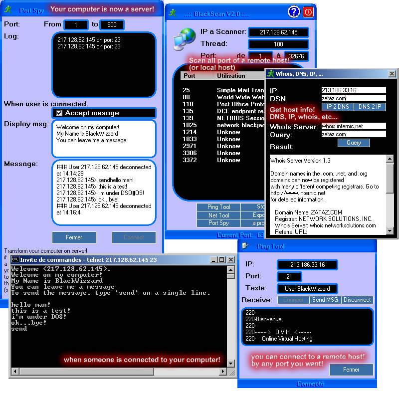



## Complet Web App :: WhoIs, DNS 2 IP, ip 2 dns, telnet server, chat under dos, portscanner, etc\.\.\.

### Description

A complet web app :: make your computer a server, WhoIs, DNS 2 IP, IP 2 DNS, port Scanner, Port Spy, all with winsock control! see screenshot for more information! ***Must See***

Please vote!
 
### More Info
 

             |
---                |---
**Submitted On**   |1998-12-02 14:32:16
**By**             |[BlackWizzard](https://github.com/Planet-Source-Code/PSCIndex/blob/master/ByAuthor/blackwizzard.md)
**Level**          |Advanced
**User Rating**    |4.2 (50 globes from 12 users)
**Compatibility**  |VB 5\.0, VB 6\.0
**Category**       |[Internet/ HTML](https://github.com/Planet-Source-Code/PSCIndex/blob/master/ByCategory/internet-html__1-34.md)
**World**          |[Visual Basic](https://github.com/Planet-Source-Code/PSCIndex/blob/master/ByWorld/visual-basic.md)
**Archive File**   |[Complet\_We389951222001\.zip](https://github.com/Planet-Source-Code/blackwizzard-complet-web-app-whois-dns-2-ip-ip-2-dns-telnet-server-chat-under-dos-portscan__1-29412/archive/master.zip)

